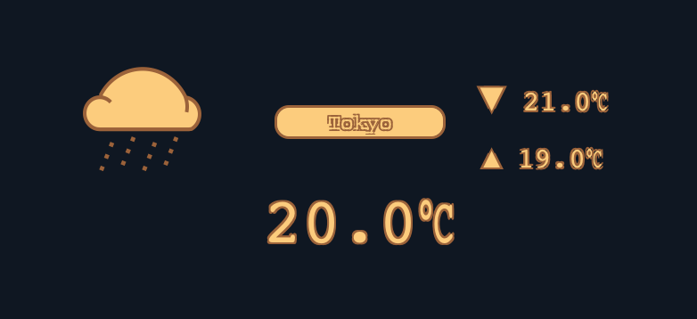

OSXwidget
============
USAGE
------------
- install
```sh
$ ./install.sh <widget_dir_name>
```

- uninstall
```sh
$ ./clean.sh <widget_dir_name>
```


nixie_clock
------------


weather
------------



structure
------------
```
widget_dir_name/  
  |- Default.png
  |- Icon.png
  |- Info.plist
  |- main.html
  |- others...
```


LICENSE
------------
[LICENSE](LICENSE "license").
